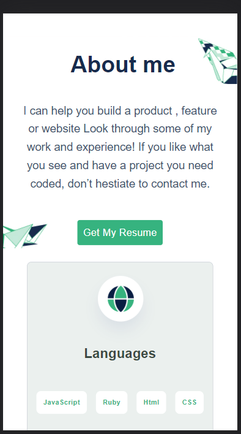
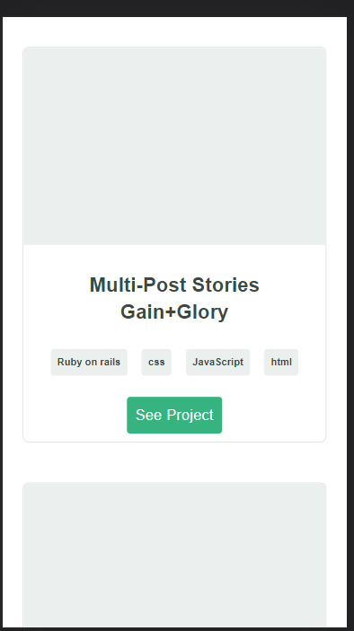

Portfolio: setup and mobile version skeleton

> This project is my portfolio setup for mobile device.

Additional description about the project and its features.

It is bult with flexbox and css grid. It contains images some are background images to make it interactive with the user.

## Built With

- HTML
- CSS

## Live Demo

[Live Demo Link](https://wes-isaac.github.io/Portfolio/)

## Getting Started

To get a local copy up and running follow these simple example steps.

Clone the repo to your local machine.

git clone https://github.com/Wes-Isaac/Portfolio.git

cd Portfolio

## Authors

👤 **Yishak**

- GitHub: [Yishak ,Wes-Isaac](https://github.com/Wes-Isaac)
- LinkedIn: [@Yishak](https://www.linkedin.com/in/yishak-wesego-b404851a7/)

## 🤝 Contributing

Contributions, issues, and feature requests are welcome!

Feel free to check the [issues page](../../issues/).

## Show your support

Give a ⭐️ if you like this project!

## Acknowledgments

- Hat tip to anyone whose code was used
- Inspiration
- etc

## 📝 License

This project is [MIT](./MIT.md) licensed.
